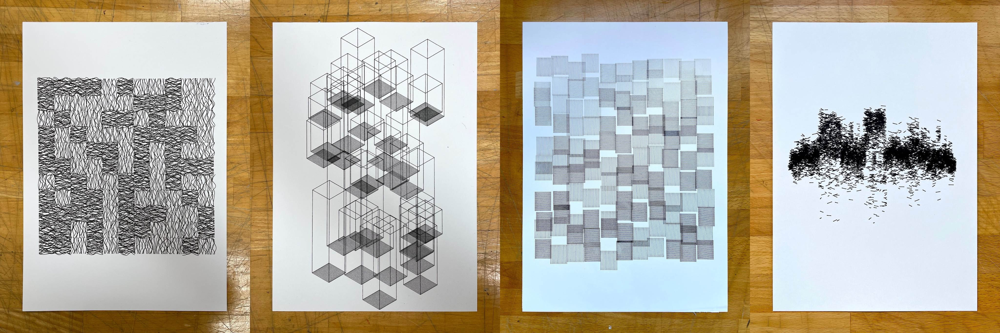

# Recoding : aux sources du dessin génératif

## Présentation
_« Recoding : aux sources du dessin génératif »_ est un atelier de programmation créative consacré à l'exploration du dessin génératif dans la continuité des expérimentations des pionniers de l'art algorithmique des années 1960 et 1970.

À partir d'une sélection de programmes issus de [recodeproject.com](https://recodeproject.com/), les participants analyseront les systèmes graphiques imaginés par d'autres artistes avant de les transformer ou de les détourner. L'objectif n'est pas de partir d'une page blanche, mais de considérer le code comme un matériau de création : lire, comprendre, modifier et faire évoluer un programme existant.

En jouant sur les paramètres, les règles ou la structure même des algorithmes, chacun développera sa propre interprétation, entre hommage, variation et expérimentation.

Les créations réalisées pendant l'atelier seront ensuite dessinées à l'aide de plotters faisant le lien entre programmation, dessin algorithmique et matérialité du trait.

## Déroulé
### Mardi 15 Septembre
- Présentation Julien / parcours.
- Présentation de l'atelier.
- Présentation et installation des outils.
- Découverte des concepts de base de la programmation : 
    - Recoding pas à pas de [« Schotter » de Georg Nees](https://collections.vam.ac.uk/item/O221321/schotter-print-nees-georg/) (1968-1970), briques programmation.
    - Expérimentation autour de cet algorithme de dessin.
- Découverte d'algorithmes classiques utilisés dans le dessin algorithmique : https://drawingbots.com/algorithms/
- Test d'impression à plusieurs sur une machine (AxiDraw v3) ou iDraw.

### Mercredi 16 & Jeudi 17 Septembre
- Découverte d'algorithmes interactions temps réel via [ml5.js](https://ml5js.org/)
- Utilisation de prompts en s'appuyant sur les connaissances pour l'aide à l'écriture de programme, être capable de comprendre et d'orienter le code généré.  
- Créations et impressions de dessin.

### Vendredi 18 Septembre
- Exposition des productions à l'école, prévoir une courte vidéo pour communiquer sur l'évènement.  

## Méthodes de travail
Pour faciliter l'impression sur traceur, nous travaillerons à partir d'un programme (ou _sketch_) template : https://editor.p5js.org/v3ga/sketches/qtX8EAO6n
Ce template intègre directement un export au format [SVG](https://developer.mozilla.org/fr/docs/Web/SVG) du dessin produit sur l'écran, avec une interface minimale (un bouton).
Plusieurs façons de créer :
1. **La plus « ardue »** : partir du template et écrire soi-même le code.
2. **La plus « naturelle »** : partir d'un programme existant sur [recodeproject.com](https://recodeproject.com/) et modifier le code, en essayant de comprendre comment tel ou tel paramètre influe sur le dessin final, comment vous pouvez modifier les commandes de dessin pour s'approprier l'écriture de code. Voir comment l'importer dans [le template](https://editor.p5js.org/v3ga/sketches/qtX8EAO6n).
3. **La plus « facile »** et plutôt dans l'air du temps : utiliser un chatbot (Claude, Copilot, ChatGPT entre autres) en lui donnant le code [du template](https://editor.p5js.org/v3ga/sketches/qtX8EAO6n) impérativement et lui indiquant précisément la composition graphique, en utilisant des algorithmes déjà connus (voir par exemple le site [drawingbots.com/algorithms](https://drawingbots.com/algorithms/))
Il est attendu au moins *un* dessin par étudiant. Je vous demanderai de décrire en quelques mots le procédé que vous avez utilisé pour produire chaque composition. 

## Ressources 
- [recodeproject.com](https://recodeproject.com/) _The ReCode Project is a community-driven effort to preserve computer art by translating it into a modern programming language (p5.js). Every translated work will be available to the public to learn from, share, and build on._
- [drawingbots.com/algorithms](https://drawingbots.com/algorithms/) _A visual catalog of the algorithms behind pen-plotter art_
- [bookofshapes.com](https://bookofshapes.com/) _A collection of minimal, generative and customizable SVG-patterns_.
- [Recoding : aux sources du dessin génératif / Stereolux / 2026](https://github.com/v3ga/Workshop_Recoding_Stereolux_2026) Atelier à Stereolux (Nantes) sur le même thème. 
